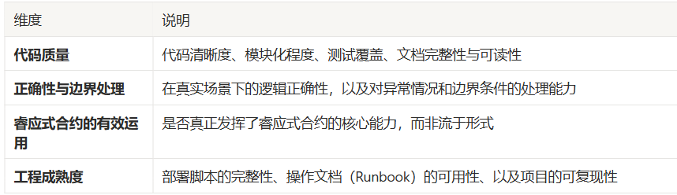

 使用睿应层技术的最低要求所有参赛项目必须满足以下条件，否则将不具备参赛资格：
 有效使用睿应式合约（Reactive Contracts）：仅将普通 Solidity 合约部署在睿应网络上是不够的。项目必须真正体现"响应性"——睿应式合约需要监听 EVM 事件，并据此自动触发相应交易。
 提交完整合约代码：项目仓库中必须包含睿应式合约（Reactive Contracts）和目标合约（Destination Contracts），以及对应的部署脚本和使用说明。
 包含 Origin 合约（如适用）：若项目使用了自定义 Origin 合约，仓库中必须一并包含这些合约及其部署脚本和说明。
 公示所有已部署合约地址：必须提供团队部署的睿应式合约地址，以及所有 Origin 和 Destination 合约地址。
 阐述问题与解决方案：需详细说明睿应式合约在该用例中解决了什么问题，以及为何没有睿应层，这个问题将更难甚至无法解决。
 提供部署后工作流说明：需以文字形式逐步描述项目部署后的完整运行逻辑。
 提供完整交易哈希记录（重要！）：团队必须实际运行整个工作流，并在提交材料中附上每一步骤的交易哈希，涵盖 Origin 交易、Reactive 交易和 Destination 交易。
 提交演示视频：必须包含一段不超过 5 分钟的演示视频，内容可包括幻灯片、旁白解说、应用或代码演示，形式不限，以最能体现项目价值为准。
 🏆 评审维度项目将从以下四个维度进行综合评判：